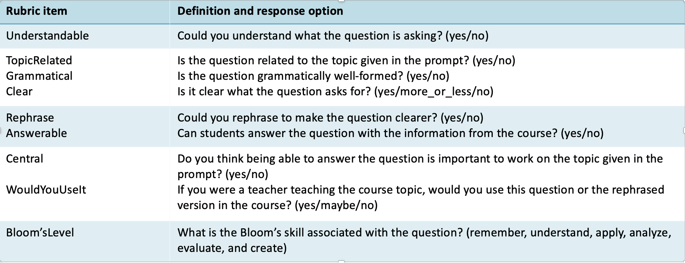

### Automated Educational Question Generation at Different Bloom’s Skill Levels using Large Language Models: Strategies and Evaluation

Developing questions that are pedagogically sound, relevant, and promote learning is a challenging and time-consuming task for educators. Modern-day large language models (LLMs) generate high-quality content across multiple domains, potentially helping educators to develop high-quality questions. Automated educational question generation (AEQG) is important in scaling online education catering to a diverse student population. Past attempts at AEQG have shown limited abilities to generate questions at higher cognitive levels. In this study, we examine the ability of five state-of-the-art LLMs of different sizes to generate diverse and high-quality questions of different cognitive levels, as defined by Bloom’s taxonomy. We use advanced prompting techniques with varying complexity for AEQG. We conducted expert and LLM-based evaluations to assess the linguistic and pedagogical relevance and quality of the questions. Our findings suggest that LLMs can generate relevant and high-quality educational questions of different cognitive levels when prompted with adequate information, although there is a significant variance in the performance of the five LLMs considered. We also show that automated evaluation is not on par with human evaluation.

### Directory Structure

```plaintext
AEQG_Blooms_Evaluation_LLMs/
├── generation_evaluation_prompts/    # Prompts used in AEQG
│   ├── EvaluationPrompt.txt          # LLM Evaluation prompt
│   ├── PS1.txt                       # Simple prompt without extra instructions
│   ├── PS2.txt                       # CoT prompt with skill and its explanation
│   ├── PS3.txt                       # CoT prompt with example questions
│   ├── PS4.txt                       # CoT prompt with skill and example questions
│   ├── PS5.txt                       # CoT prompt with skill, its explanation, and example questions
├── generated_questions/              # Question generated using LLMs
│   ├── PS1_ExpertEvaluation.xlsx     # Expert evaluation of questions generated through PS1
│   ├── PS1_QualityQuestions.xlsx     # Quality questions generated through PS1
│   ├── PS2_ExpertEvaluation.xlsx     # Expert evaluation of questions generated through PS2
│   ├── PS2_QualityQuestions.xlsx     # Quality questions generated through PS2
│   ├── PS3_ExpertEvaluation.xlsx     # Expert evaluation of questions generated through PS3
│   ├── PS3_QualityQuestions.xlsx     # Quality questions generated through PS3
│   ├── PS4_ExpertEvaluation.xlsx     # Expert evaluation of questions generated through PS4
│   ├── PS4_QualityQuestions.xlsx     # Quality questions generated through PS4
│   ├── PS5_ExpertEvaluation.xlsx     # Expert evaluation of questions generated through PS5
│   ├── PS5_QualityQuestions.xlsx     # Quality questions generated through PS5
├── README.md    
```

### Expert Evaluation Metrics



### Citation

If you find our dataset and work beneficial, please cite our work:

```bibtex
@inproceedings{scaria2024automated,
  title={Automated Educational Question Generation at Different Bloom’s Skill Levels Using Large Language Models: Strategies and Evaluation},
  author={Scaria, Nicy and Dharani Chenna, Suma and Subramani, Deepak},
  booktitle={International Conference on Artificial Intelligence in Education},
  pages={165--179},
  year={2024},
  organization={Springer},
  url={https://link.springer.com/chapter/10.1007/978-3-031-64299-9_12}
}
```
